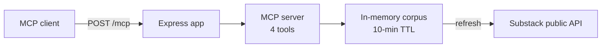

<div align="center">

# ⚡ Rimas Logic MCP Server

**Read [The AI Logic](https://rimaslogic.substack.com/) newsletter straight from your AI assistant.**

An open [Model Context Protocol](https://modelcontextprotocol.io) server — no signup, no API key.

[](https://github.com/rimaslogic/mcp-server/actions/workflows/ci.yml)
[](LICENSE)
[](package.json)
[](tsconfig.json)
[](https://modelcontextprotocol.io)

```
https://mcp.rimaslogic.pl/mcp
```

</div>

---

## 🚀 Quick start

**Claude Code**

```bash
claude mcp add --transport http rimas-logic https://mcp.rimaslogic.pl/mcp
```

**Claude.ai** — Settings → Connectors → *Add custom connector* → paste the URL above.

**Cursor / ChatGPT / any MCP client** — add a remote MCP server (streamable HTTP) with the URL above.

Then just ask: *"What has The AI Logic written about n8n?"*

## 🧰 Tools

| Tool | What it does |
|------|--------------|
| 📚 `list_articles` | All published articles, newest first — issue number, title, date, slug, URL |
| 📖 `get_article` | One article in full, as markdown — by slug or issue number (`"25"`) |
| 🔍 `search_articles` | Keyword search over titles, subtitles, and bodies, with excerpts |
| 💡 `about_the_ai_logic` | What the newsletter is, subscribe links, how to work with Rimas |

## ⚙️ How it works



One stateless Node/Express service. It pulls the publication's public Substack
API, converts every article to markdown once per refresh, and holds the whole
corpus in memory. If a refresh fails it serves the cached copy and says so in
the tool output. Each `POST /mcp` request gets a fresh MCP server instance over
the streamable HTTP transport.

| Endpoint | Purpose |
|----------|---------|
| `POST /mcp` | The MCP endpoint (stateless, streamable HTTP) |
| `GET /` | Human landing page with setup instructions |
| `GET /health` | Cache age, article count, staleness |

**Privacy & safety:** read-only, no data collected about callers, no secrets in
the service (env is just `PORT` and `SUBSTACK_URL`), rate limited to
60 req/min per IP, and it only ever fetches one hardcoded Substack host.

## 🛠️ Local development

```bash
npm install
npm test        # vitest — fixture-based, no network needed
npm run dev     # build + run on http://localhost:3000
```

Deployed on [Railway](https://railway.com); `railway.json` holds the build and
start commands.

## 📬 About

Built by [Rimas Lukaszewicz](https://rimaslogic.pl) (Rimas Logic).
The AI Logic is a weekly newsletter about what actually works when you put AI
and automation into a business — real builds, real failures, and the logic
behind them.

- 📰 [Subscribe on Substack](https://rimaslogic.substack.com/)
- 💼 [Follow on LinkedIn](https://www.linkedin.com/build-relation/newsletter-follow?entityUrn=7478659510924959744)
- 🗓️ [Book an AI consultation](https://cal.com/rimas-lukaszewicz/ai-consultation)

## 📄 License

[MIT](LICENSE)
